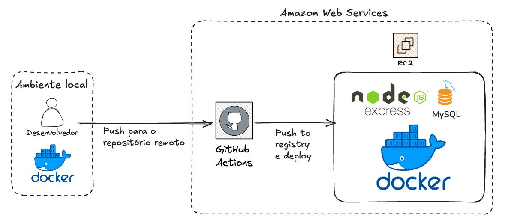

<h1 align="center"></h1>

  <strong>O mais novo guia de perguntas!</strong>

O projeto consiste em um fórum, em que podem ser postadas perguntas e feitas respostas. A aplicação foi hospedada em um [ambiente de testes](https://queueunderflow-test.izaias.me) e também em um [ambiente de produção](https://queueunderflow.izaias.me). Além disso, foi disponizado [um relatório técnico da aplicação](./docs/relatorio.pdf).

## Arquitetura da Solução

## Pré-requisitos

Antes de começar, certifique-se de ter os seguintes componentes instalados em sua máquina.

- **Node.js** (versão 20.9.0): [Download Node.js](https://nodejs.org/)
- **MySQL**: [Download MySQL](https://dev.mysql.com/downloads/)
- **Docker** (Download alternativo ao MySQL): [Download Docker](https://www.docker.com/get-started)

## Tecnologias Utilizadas

- BCrypt
- JSONWebToken
- Prisma.js
- EJS
- Bootstrap 5.3
- Express.js

## Como executar o projeto localmente

1. Clone o projeto na sua máquina local `git clone https://github.com/izaiasmachado/guia-de-perguntas.git`
2. Modifique o nome do arquivo `.env.example` para `.env`
3. Caso deseje usar Docker para rodar o banco execute `docker compose up -d`
4. Instale as dependências do projeto `npm install`
5. Execute as migrations no banco de dados `npx prisma db push`
6. Execute o comando para rodar a aplicação localmente `npm run dev`
7. Acesse a aplicação em `http://localhost:3333`

**Obs:** Caso deseje hospedar um banco próprio, altere o arquivo `.env` com as credenciais desse banco.

## Equipe

|  <strong>Gabriel Vasconcelos</strong> |  <strong>Izaias Machado</strong> |  <strong>Marcos Vinícius</strong> |  <strong>William Lima</strong> |  <strong>Yann Lucca</strong> |
| :------------------------------------------------------------------------------------------------------------------------------: | :-------------------------------------------------------------------------------------------------------------------------: | :-------------------------------------------------------------------------------------------------------------------: | :----------------------------------------------------------------------------------------------------------------------: | :---------------------------------------------------------------------------------------------------------------------: |
|                                [LinkedIn](https://www.linkedin.com/in/gabrielvasconcelossantos/)                                 |                                   [LinkedIn](https://www.linkedin.com/in/izaiasmachado/)                                    |                         [LinkedIn](https://www.linkedin.com/in/marcosvinciusandradedesousa/)                          |                               [LinkedIn](https://www.linkedin.com/in/william-bruno-sales/)                               |                                    [LinkedIn](https://linkedin.com/in/yann-miranda)                                     |
|                                               [GitHub](https://github.com/GabVS4)                                                |                                         [GitHub](https://github.com/izaiasmachado)                                          |                                      [GitHub](https://github.com/MarcosVini9999)                                      |                                        [GitHub](https://github.com/williambrunos)                                        |                                          [GitHub](https://github.com/yannluk4)                                          |
