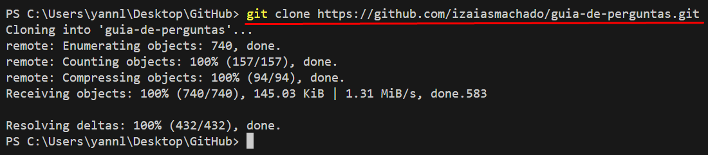
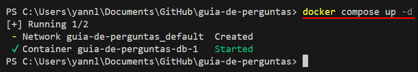
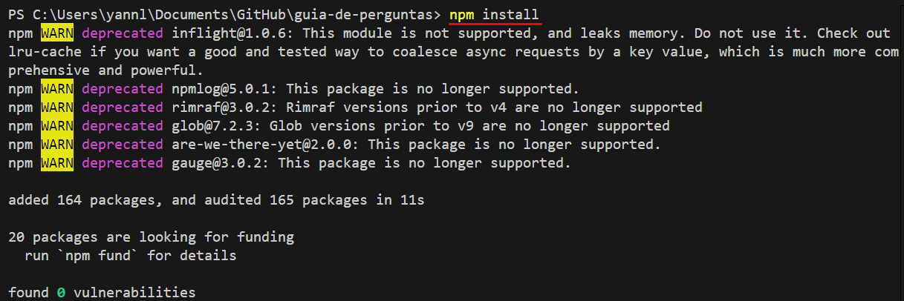
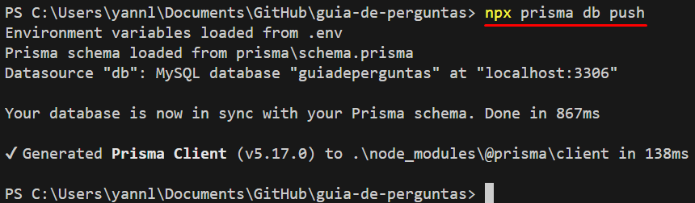
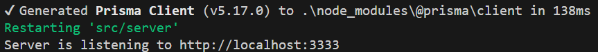
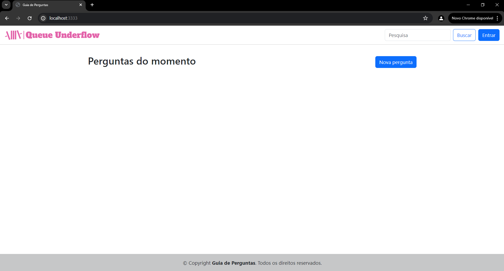

<h1 align="center"></h1>

## Objetivos do Projeto:

O objetivo do projeto é desenvolver uma plataforma de perguntas e respostas utilizando MySQL como banco de dados e frameworks back-end e front-end, além de outras tecnologias.

## Arquitetura da Solução


## Pré-requisitos

Antes de começar, certifique-se de ter os seguintes componentes instalados em sua máquina:

- **Node.js** (versão 20.9.0): [Download Node.js](https://nodejs.org/)
- **MySQL**: [Download MySQL](https://dev.mysql.com/downloads/)
- **Docker** (Opcional): [Download Docker](https://www.docker.com/get-started)

## Tecnologias Utilizadas

- BCrypt
- JSONWebToken
- Prisma.js
- EJS
- Bootstrap 5.3
- Express.js

  
## Como executar o projeto localmente

1. Clone o projeto na sua máquina local:

`````bash
git clone https://github.com/izaiasmachado/guia-de-perguntas.git
`````

<h1 align="center"></h1>

2. Modifique o nome do arquivo `.env.example` para `.env`
3. Execute o seguinte comando para criar o container docker contendo o MySQL

````bash
docker compose up -d
````

<h1 align="center"></h1>

4. Execute o seguinte comando para instalar as dependências do projeto

````bash
npm install
````

<h1 align="center"></h1>

5. Execute o seguinte comando para executar as migrations e criar o banco de dados

````bash
npx prisma db push
````

<h1 align="center"></h1>

6. Execute o seguinte comando para rodar a aplicação localmente

````bash
npm run dev
````

<h1 align="center"></h1>

7. O site abrirá altomaticamente após isso

<h1 align="center"></h1>

| <br><strong>Gabriel Vasconcelos</strong> | <br><strong>Izaias Machado</strong> | <br><strong>Marcos Vinícius</strong> | <br><strong>William Lima</strong> | <br><strong>Yann Lucca</strong> |
| :---------------------------------------------------------------------------------------------------: | :--------------------------------------------------------------------------------------------------------: | :------------------------------------------------------------------------------------------------------: | :------------------------------------------------------------------------------------------------------: | :-----------------------------------------------------------------------------------------------------: |
|                          [LinkedIn](https://www.linkedin.com/in/gabrielvasconcelossantos/)                           |                           [LinkedIn](https://www.linkedin.com/in/izaiasmachado/)                           |                     [LinkedIn](https://www.linkedin.com/in/marcosvinciusandradedesousa/)                      |                       [LinkedIn](https://www.linkedin.com/in/william-bruno-sales/)                       |                            [LinkedIn](https://linkedin.com/in/yann-miranda)                             |
|                                [GitHub](https://github.com/GabVS4)                                 |                                 [GitHub](https://github.com/izaiasmachado)                                 |                                [GitHub](https://github.com/MarcosVini9999)                                |                                [GitHub](https://github.com/williambrunos)                                |                                  [GitHub](https://github.com/yannluk4)                                  |
